## Application Setup V1.0

### CONTENTS

  - [Location](#location)
  - [Application Configuration](#application-configuration)
  - [Lookps](#lookups)

____

### Location

**Navigation: Setup -> Business Group -> Location**

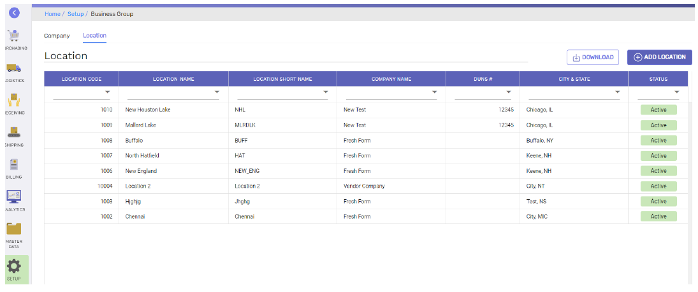

* Location section contains the summary information of all operating business locations defined for the client.
* Column positions can be changed, Data can be filtered and downloaded to excel using the download option

**How to define a new location?**

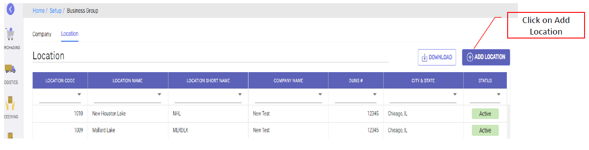

* New location can be defined by click on ‘Add Location’, which opens the location definition page

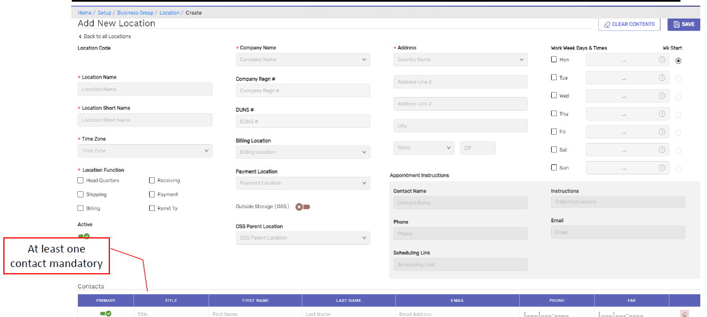

- All New location screen is to define operating business locations of the client

____

### APPLICATION CONFIGURATION

**Navigation: Setup -> Application Configuration**

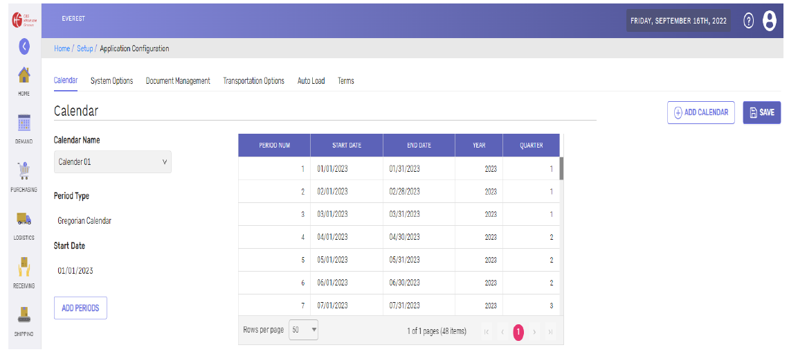

**Calendar:**

Click on Add calendar in ‘calendar’ tab.

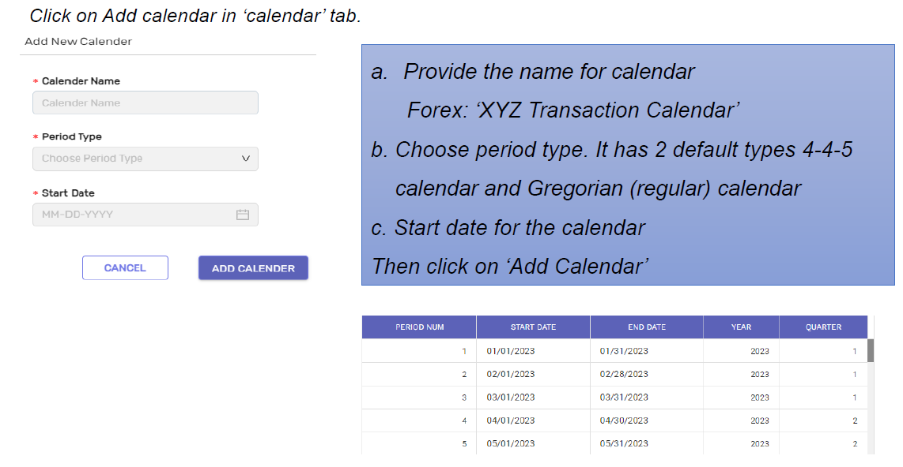

**System options:**

Click on system options tab to navigate and configure the system options that control the overall system for the client.

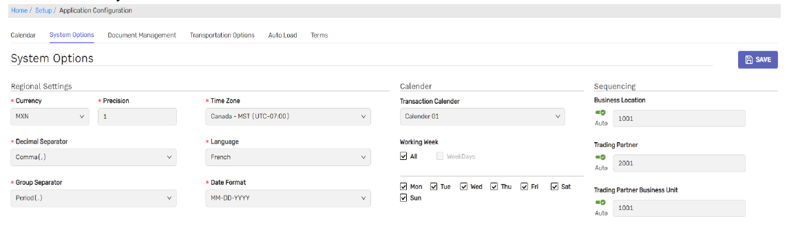

- All mandatory settings for this screen are marked and the labels are self explanatory
- Sequencing: Sequencing is for numbering sequence of locations, trading partners and partner business/operating unit configurations.
- Click on SAVE once the updates are done.

**Document Management:**

Click on document management tab to navigate and configure the transactional level number sequencing for the client.

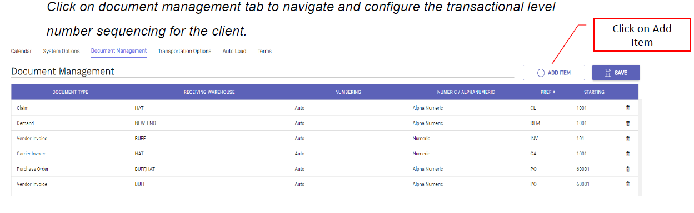

- Document management section contains the transaction numbering preferences of the client for each of the transaction type applicable as per the client’s business type.
i.e. customer/vendor/carrier.
- Click on SAVE once numbering sequence is defined.

**Transportation Options:**

Click on Transportation options tab to navigate and configure the transportation shipping and receiving segments, container information.
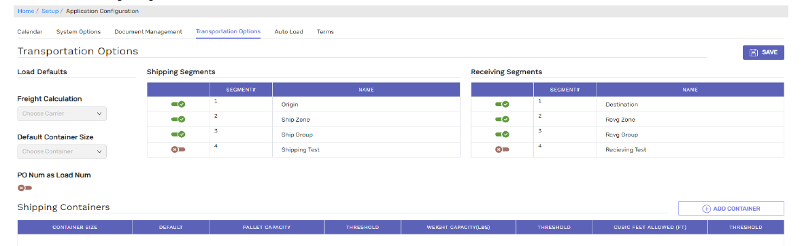

- Transportation options controls the load management process of the customer as part of their transportation planning.
- Up to 4 Shipping and receiving segments can be defined based on the client’s geographic operations for transportation purposes.

**Auto Load:**

Click on Auto load tab to navigate and configure the options enables automatic load building and recommend the loads for the client to review and confirm.
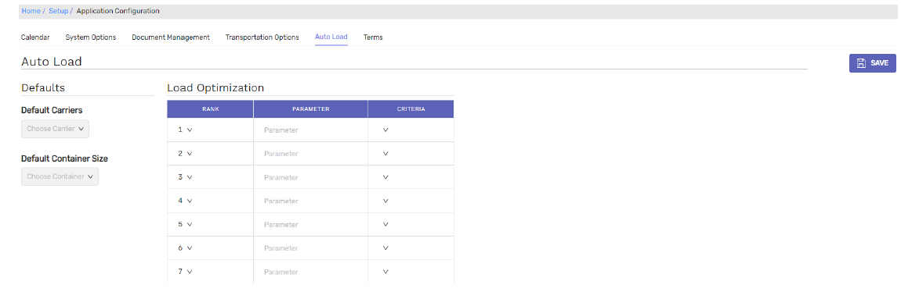

**Terms:**

- Click on terms tab to navigate and configure the payment term information which eventually can assign to the trading partner records for billing due date calculation purposes.
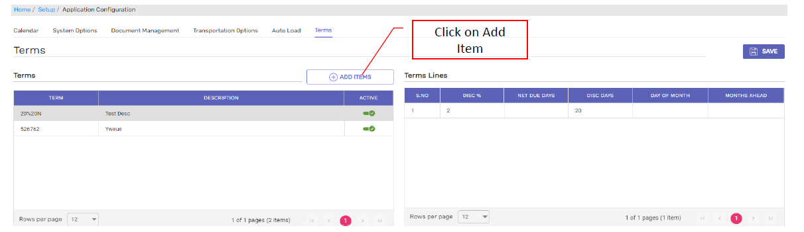

- Terms section contains 2 parts, i.e.
  - Term Definition – contains the name and description of the term
  - Term lines definition – Select the term definition to see the details of the term lines
- Click on SAVE once the term is defined.

_____

### LOOKUPS

**Navigation: Setup -> Lookups**
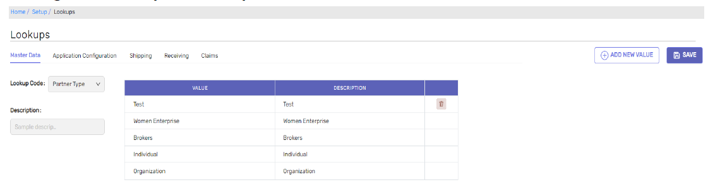

- Lookups, as the name suggests they are values that are common at multiple places. 
- These lookup values are referred at multiple master data or transactional data screens so that they appear as dropdown list of values to choose from.
- For some of these lookups, there is a flexibility of extending the list of values by client as needed.
